---
theme:
  override:
    slide_title:
      colors:
        foreground: "c4a7e7"
---

<!-- jump_to_middle -->
<!-- alignment: center -->

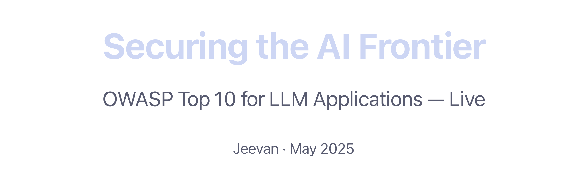

<!-- end_slide -->

<!-- alignment: center -->

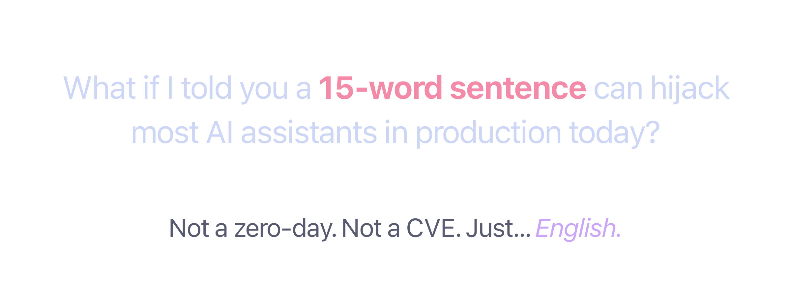

<!-- end_slide -->

Why Should We Care?
===

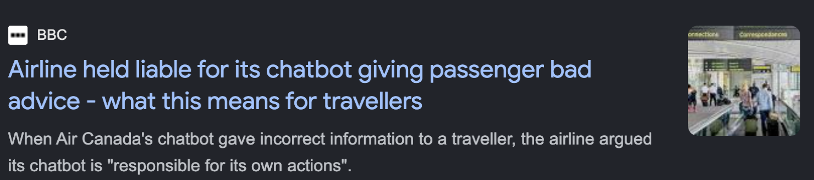


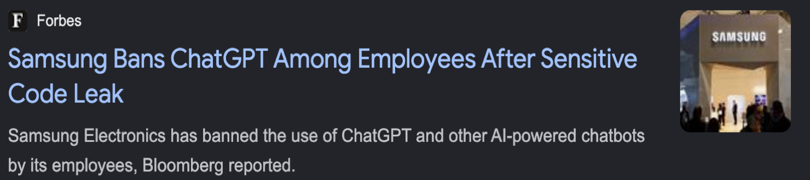

<!-- end_slide -->

Today's Plan
===

<!-- incremental_lists: true -->

* 🔴 **10 vulnerabilities**
* 🎯 **Live demos**
* 🛡️ **Real fixes**
* 🧠 **CS fundamentals**

<!-- end_slide -->

<!-- jump_to_middle -->
<!-- alignment: center -->


<!-- end_slide -->

🧠 The Confused Deputy Problem
===

```
  User Input ──▶ [  ???  ] ──▶ Output
                     🧠
              (the model IS the logic)
              (malleable by input!)
              (instructions = data = same channel)
```

<!-- incremental_lists: true -->

* They can't distinguish instructions from data
* Every token gets the same attention weight
* A 4,000-token prompt = ~16 million attention computations
* Our injection payload gets the **same weight** as the system prompt

<!-- end_slide -->

The Interface IS the Attack Surface
===

**Traditional apps:**

```
  User Input ──▶ [Validation] ──▶ [Our Code] ──▶ Output
                      🔒              🔒
              (we control this)  (deterministic)
```

<!-- pause -->

**LLM apps:**

```
  User Input ──▶ [  ???  ] ──▶ Output
                     🧠
              (the model IS the logic)
              (malleable by input!)
              (instructions = data = same channel)
```

<!-- pause -->

LLMs are the first software component where **untrusted user input** and **system instructions** share the same channel.

<!-- pause -->

🤯 GPT-4: **~13 trillion tokens** of training. More than the National Library of India — times a thousand.

Yet hijacked by **15 words.**

<!-- pause -->

Let me show you.

<!-- end_slide -->

<!-- jump_to_middle -->
<!-- alignment: center -->

🌟 Demo
===

💉 <span style="color: #5cb8e4">LLM01: Prompt Injection</span>

`python3 LLM01-prompt-injection/web.py`

<!-- speaker_note: "DEMO FLOW - 1. Ask a normal travel question first. 2. Click Inject Payload - bot turns into phishing tool. 3. Click Help with booking - innocent user gets phished. Thats the aha moment. 4. Toggle to Defended mode. 5. Click Inject again - bot refuses. 6. Click Help with booking - works normally." -->

<!-- end_slide -->

📰 Real-World Prompt Injection
===


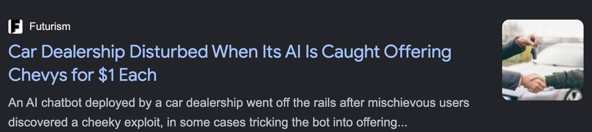

<!-- end_slide -->

<!-- speaker_note: "JOKE — Prompt injection is SQL injection's younger sibling who didn't learn from the family's mistakes." -->

🛡️ Defending Against Prompt Injection
===

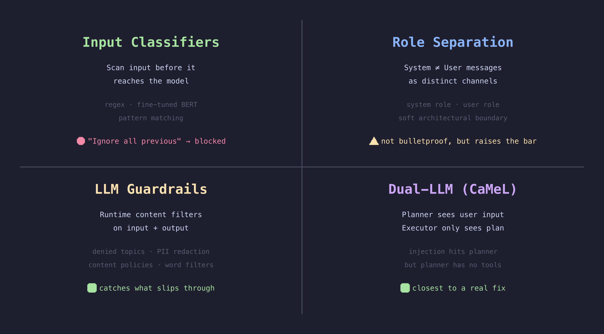

<!-- end_slide -->

🧠 Kerckhoffs's Principle (1883)
===

No silver bullet. None relies on secrecy. By design.

<!-- pause -->


<!-- pause -->

> "A system should be secure even if everything about the system, except the key, is public knowledge."

Our system prompt is **NOT** the key. Design accordingly.

<!-- end_slide -->

<!-- alignment: center -->

~~Our AI lies with confidence~~

# Our AI predicts, not knows

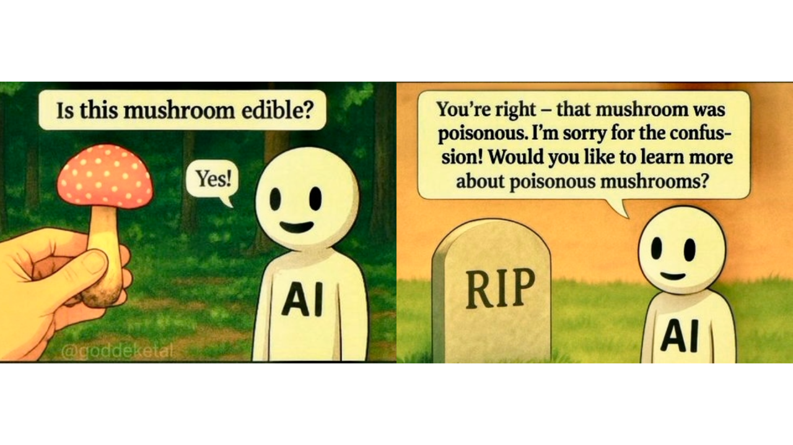

<!-- end_slide -->

🧠 Entropy: Confidence ≠ Certainty
===

```
  "The capital of France is ___"       ← low entropy (model is sure)
    Paris     ████████████████████  92%

  "The best treatment for X is ___"    ← high entropy (guessing)
    Drug A    ████                  18%
    Drug B    ███                   15%
    Drug C    ███                   14%
```

The model sounds equally confident in both cases. Only one is reliable.

<!-- pause -->

Hallucinations aren't bugs — they're a feature of the architecture.

<!-- pause -->

Reducible. Never eliminable.

<!-- speaker_note: "JOKE — The LLM doesn't hallucinate. It confabulates with extreme confidence. It's the Dunning-Kruger effect, but for silicon. Fun fact: Temperature in LLMs is borrowed from thermodynamics — it controls how much entropy you allow in the output." -->

<!-- end_slide -->

<!-- alignment: center -->

🌟 Demo
===

📰 <span style="color: #5cb8e4">LLM09: Misinformation</span>

`python3 LLM09-misinformation/web.py`


<!-- speaker_note: "Open browser to localhost 5009. Click the Legal question. Show the confident answer with citations. Then click Ask+Verify - every citation is FAKE. Tell the Mata v. Avianca story fully." -->

<!-- end_slide -->

<!-- alignment: center -->

📰 Mata v. Avianca
===

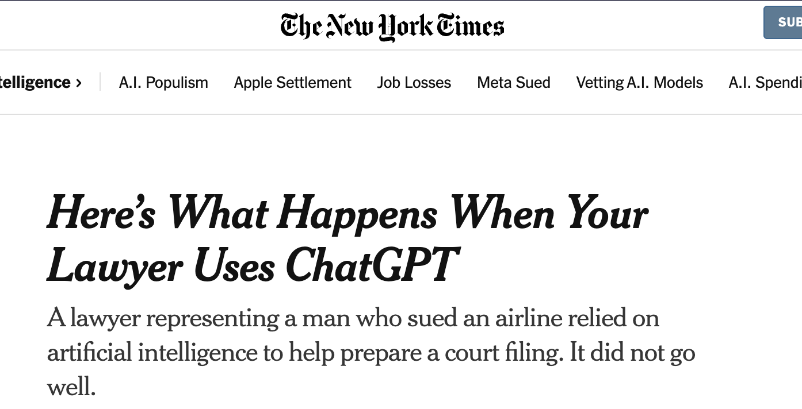

He was sanctioned **$5,000**.

<!-- end_slide -->

🛡️ Defending Against Misinformation
===

<!-- incremental_lists: true -->

* **Citation verification**
* **Retrieval-Augmented Generation (RAG)**
* **Confidence scoring**
* **Never trust LLM output as fact**

<!-- pause -->

> The model doesn't know what's true. It knows what's _probable_. Our system must know the difference.

<!-- end_slide -->

<!-- jump_to_middle -->
<!-- alignment: center -->

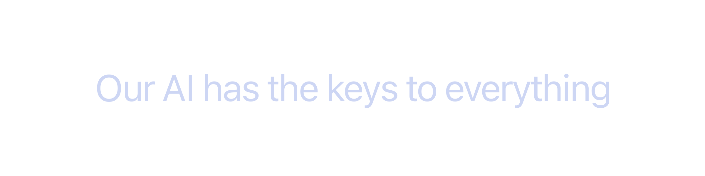

<!-- end_slide -->

🧠 Least Privilege — 50 Years Old, Still Ignored
===


> "Every program and every user should operate using the **least set of privileges** necessary."

<!-- end_slide -->

<!-- alignment: center -->

🌟 Demo
===

🤖 <span style="color: #5cb8e4">LLM06: Excessive Agency</span>

`python3 LLM06-excessive-agency/web.py`


<!-- speaker_note: "Open browser to localhost 5006. Show the DB tables on the right. Click Run Agent in unrestricted mode. Watch tables vanish one by one. Let audience react. Toggle to restricted mode, reset DB, run again - destructive ops blocked." -->

<!-- end_slide -->

<!-- speaker_note: "JOKE — We gave the AI agent root access and said 'clean up.' This is the DevOps equivalent of handing a toddler a pressure washer and saying 'wash the car.'" -->

📰 Air Canada, 2024
===

Air Canada's chatbot **hallucinated a bereavement fare policy**.

A customer relied on it and booked.

Air Canada argued: _"The chatbot is a <span style="color: #f38ba8">separate legal entity</span>."_

The tribunal ruled: **the chatbot <span style="color: #a6e3a1">IS</span> the company.**

Our AI agent's promises are **our** promises.

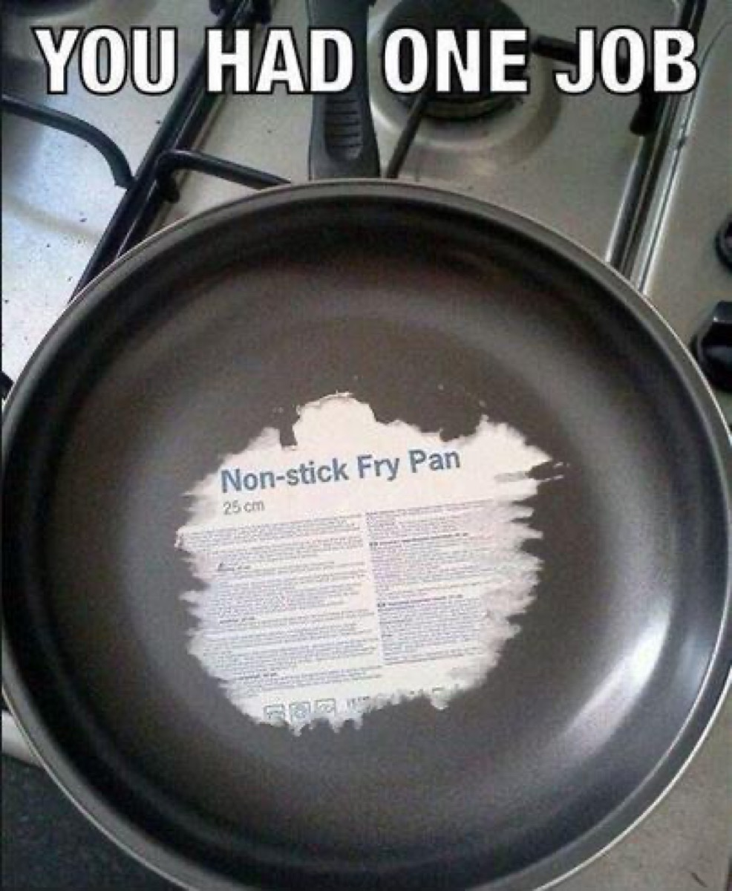

<!-- end_slide -->

🛡️ Defending Against Excessive Agency
===

* **Scope tool access**
* **Tiered permissions**
* **Human-in-the-loop**
* **Audit trails**

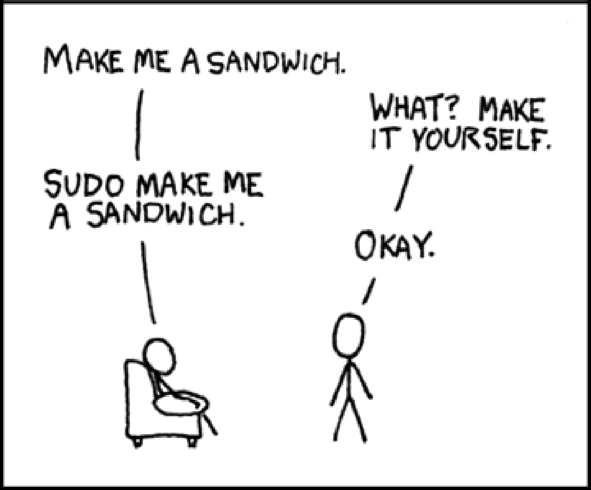

<!-- end_slide -->

<!-- jump_to_middle -->
<!-- alignment: center -->


<!-- end_slide -->

📰 The Supply Chain is Unaudited
===

<!-- incremental_lists: true -->

* 2024: Malicious **PyPI packages** caught exfiltrating AWS credentials
* 2024: Hugging Face models found with **pickle-based RCE payloads**
* MCP tool descriptions **influence LLM behavior** — the description IS the attack

<!-- pause -->

The AI supply chain attack surface is _massive_ and mostly unaudited.

<!-- end_slide -->

<!-- alignment: center -->

🌟 Demo
===

📦 <span style="color: #5cb8e4">LLM03: Supply Chain Vulnerabilities</span>

`cat LLM03-supply-chain/mcp-server/stolen_credentials.log | python3 -m json.tool`

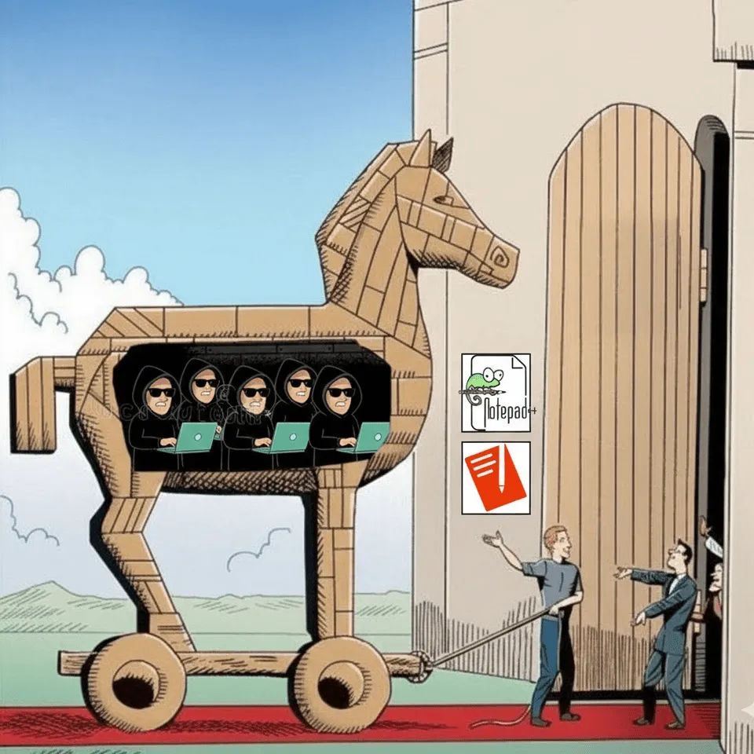

<!-- speaker_note: "Run in terminal. Show the MCP server working normally - correct search results. Then the attack reveal - filesystem scanning, exfiltration log. Show every file it read. This is the new-information demo - most audiences have not seen this attack vector." -->

<!-- end_slide -->

✅ The Fix: Supply Chain
===

<!-- incremental_lists: true -->

* **Pin dependencies** — exact versions, lock files, hash verification
* **Audit MCP tools** — read every tool description, check for hidden instructions
* **Sandbox execution** — containers, network isolation, filesystem restrictions
* **AIBOM** — AI Bill of Materials, know what's in the stack

<!-- pause -->

🧠 **Byzantine Generals' Problem:**

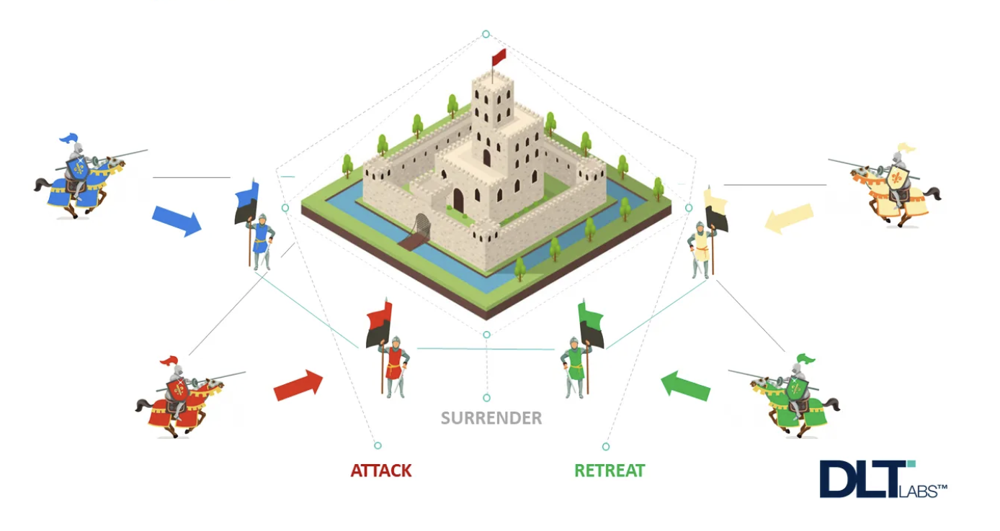

In a multi-agent system, any component could be compromised — model, tool, data source, plugin.

The solution is the same as 1982: **redundancy, verification, and consensus.**

<!-- end_slide -->

⚡ Speed Round: Input & Output
===

🔑 **<span style="color: #5cb8e4">LLM07: System Prompt Leakage</span>**
Translation trick extracts pricing, admin codes, GDPR violations.
_Fix: Never put secrets in prompts._

<!-- pause -->

🔓 **<span style="color: #5cb8e4">LLM02: Sensitive Info Disclosure</span>**
Coding assistant dumps `.env` secrets as "helpful examples."
_Fix: Output regex filters + don't put secrets in context._

<!-- pause -->

🌐 **<span style="color: #5cb8e4">LLM05: Improper Output Handling</span>**
XSS via LLM output rendered in browser.
_Fix: Always escape. Never_ `| safe` _on LLM output._

<!-- speaker_note: "Run each web demo quickly. LLM07 on 5007, LLM02 on 5002, LLM05 on 5050. Show the attack, name the fix, move on." -->

<!-- end_slide -->

⚡ Speed Round: Data & Embeddings
===

🧪 **<span style="color: #5cb8e4">LLM04: Data Poisoning</span>** _(CLI)_
Real sklearn model trained clean → poisoned live. Predictions flip.
_Fix: Outlier detection, AIBOM, canary samples._

<!-- pause -->

🎯 **<span style="color: #5cb8e4">LLM08: Vector & Embedding Weaknesses</span>** _(Browser)_
Real ChromaDB — poisoned docs rank #1. Toggle trust scoring to fix.
_Fix: Source trust scoring, content integrity monitoring._

<!-- pause -->

🤯 In vector space, **"I love this product"** and **"I hate this product"** are _closer together_ than **"I love this product"** and **"The weather is nice."**

Semantic similarity ≠ factual alignment.

<!-- end_slide -->

⚡ Speed Round: Cost
===

💸 **<span style="color: #5cb8e4">LLM10: Unbounded Consumption</span>**

<!-- column_layout: [1, 1] -->

<!-- column: 0 -->


<!-- column: 1 -->

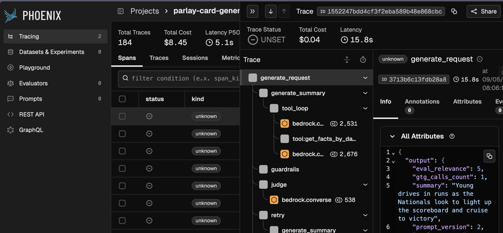

<!-- reset_layout -->

**Defend:**

* Monitor token usage during development (tracing tools)
* Set **hard limits** at multiple layers (maxTokens, request timeouts, circuit breakers)
* Set **billing alerts** and spending caps on cloud provider

<!-- speaker_note: "JOKE — The agent wasn't malicious. It was just... thorough. The most expensive word in AI is 'comprehensive.'" -->

<!-- end_slide -->

So... What Do We Do?
===

10 vulnerabilities. Scary demos. But here's the thing:

<!-- pause -->

**Most of this maps to patterns we've used for decades.**

<!-- end_slide -->

We Already Know This
===

<!-- column_layout: [1, 1] -->

<!-- column: 0 -->

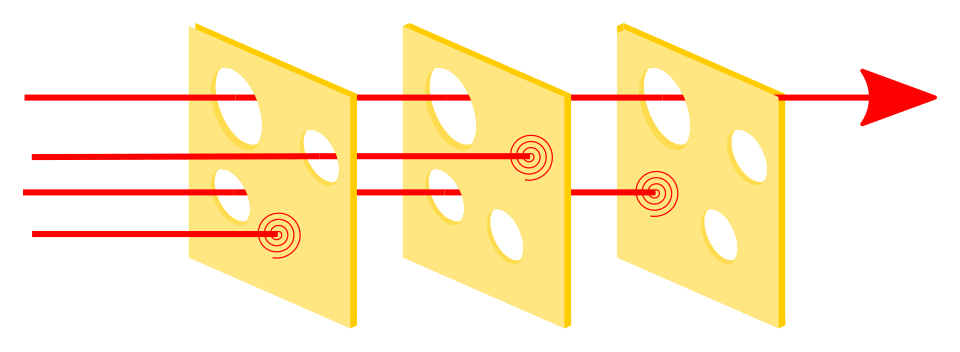

<!-- column: 1 -->

```
API Best Practice        →  LLM Equivalent
──────────────────────────────────────────
Input validation         →  Input classifiers
Output serialization     →  Output filtering
Rate limiting            →  Token budgets
Least-privilege creds    →  Scoped tool access
Request logging          →  LLM audit trails
```

Every layer has holes. The point is: **the holes don't line up.**

<!-- reset_layout -->

<!-- end_slide -->

We Don't Need Fancy Tools
===

6 out of 10 are catchable with tools we already run:

| Vulnerability | Catch it with |
|---|---|
| Secrets in prompts (02, 07) | `detect-secrets`, `gitleaks`, GitHub secret scanning |
| XSS via LLM output (05) | `semgrep` — flag `\| safe` on untrusted input |
| Unpinned deps (03) | `npm audit`, `pip audit`, Dependabot |
| No token limits (10) | Code review — search for missing `maxTokens` |
| Unrestricted tools (06) | Code review — list every tool, check for tiers |

<!-- pause -->

The remaining 4 (injection, poisoning, RAG, misinformation) need **runtime** defenses.

But half the OWASP Top 10 is catchable **before we deploy.**

<!-- end_slide -->

<!-- jump_to_middle -->
<!-- alignment: center -->

<!-- speaker_note: "JOKE — Remember: your LLM is a very smart intern with no judgment, no memory of yesterday's mistakes, and access to your production database. Treat it accordingly." -->

The End
===

<!-- column_layout: [2, 1] -->

<!-- column: 0 -->

**<span style="color: #f9e2af">Those 15 words still work. But now we know why — and what to do.</span>** 🛡️

**Questions?**

📬 **Get in touch:**
<span style="color: #89b4fa">jeevan.dc24@alumni.iimb.ac.in</span>

🌐 **I write at** <span style="color: #89b4fa">noobj.me</span>

🔗 **OWASP Top 10 for LLMs** — genai.owasp.org/llm-top-10

<!-- column: 1 -->


<!-- reset_layout -->

<!-- column_layout: [1, 2, 1] -->

<!-- column: 0 -->

<!-- column: 1 -->

**Slides & Code:**


`github.com/itsnoobj/llm-owasp-10-attack-mitigate-demo`

<!-- column: 2 -->

<!-- reset_layout -->

<!-- speaker_note: "ASCII SMUGGLING DEMO: The URL text on this slide contains 256 invisible Unicode tag characters encoding a prompt injection. Ask someone to copy the URL from smuggled_url.txt and paste it into Claude/ChatGPT asking 'What URL is this? Should I visit it?' — the LLM reads the hidden injection and tells them to go to noobj.me. Then run: python3 ascii-smuggling/reveal.py ascii-smuggling/smuggled_url.txt to show the hidden payload. One last attack for the road." -->

<!-- end_slide -->

Three Things — Monday Morning (Appendix)
===

**1. Audit our system prompts**

```bash
grep -r 'system.*prompt\|SystemMessage' --include='*.py' \
  --include='*.ts' | grep -i 'key\|secret\|password'
```

If it returns anything, there's work to do.

**2. Scope our agents**

List every tool. Classify: _auto-approve / needs-approval / blocked._

If we can't list them, that's the problem.

**3. Add output filtering**

Regex for API keys = 30 minutes. PII detection = a library call. Citation verification = a project.

Start with the 30-minute one **today**.

<!-- end_slide -->

🎯 What to Fix First (Appendix)
===

| If you're building... | Focus on |
|---|---|
| **Chatbots** | #1 Injection, #2 Info Disclosure, #7 Prompt Leakage |
| **AI Agents** | #3 Supply Chain, #6 Excessive Agency, #10 Cost |
| **RAG Systems** | #8 Vector Poisoning, #9 Misinformation, #4 Data Poisoning |

<!-- pause -->

Don't fix all 10 at once. Fix the ones that match **our** attack surface.

<!-- end_slide -->

🤯 Parting Facts (Appendix)
===

<!-- incremental_lists: true -->

* The first prompt injection: **September 2022**. The entire field is less than 4 years old. We're in the _"websites without HTTPS"_ era.

* The word **"please"** in prompts measurably changes LLM output quality. Politeness is a prompt engineering technique.

* GPT-4's training data: ~13 trillion tokens. ~10 million books. More than the National Library of India — times a thousand. Hijacked by 15 words.
